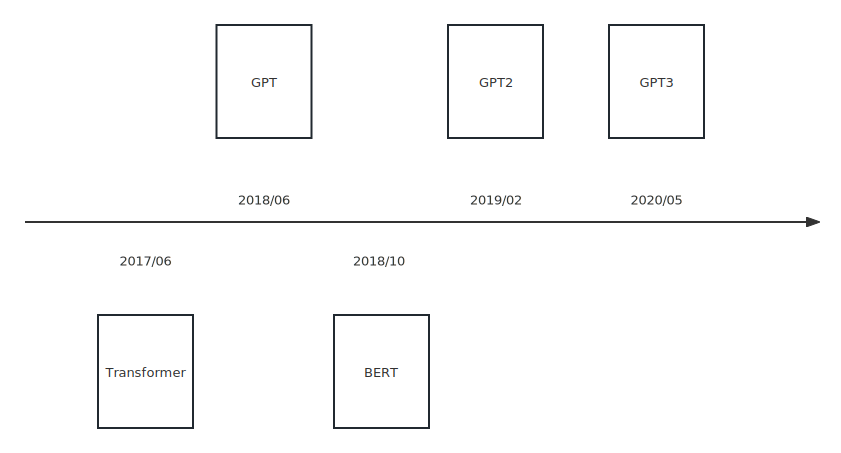

# GPT

### GPT系列的发展

**核心技术**：使用Transformer的解码器，在没有标签的大量文本数据上使用自监督的方式进行训练得到预训练模型，然后把预训练模型在下游任务上做微调。

<figure><figcaption>
GPT的演变过程
</figcaption></figure>

在下游任务进行迁移时，通过构造和任务相关的输入从而使得我们只要很少的改变模型架构就可以。之前的模型需要根据任务进行构造，GPT这里只需要改变输入的形式就可以不用动模型的架构。

### 文本任务和图片任务的区别

不同任务的图片输入一般是确定的，而文本不同，有些输入是一个词，有些输入是一个句子，有些输入是几个句子

### GPT 要解决的问题

* 尽管当前没有标签的文本数据很丰富，但是细化到自然语言处理中有很多字领域的有标签的数据很少
* 使用没有标签的文本时，优化目标难以确定
* 如何把模型学习到的文本表征一致的传递到所有下游子任务

### 模型架构

#### 无监督预训练

假设一个没有标签的句子为 $$μ=\{μ1,...,μn\}$$，语言模型的目标为最大化似然函数$$L_1(\mu)$$,其中$$k$$为窗口上下文的长度，$$P$$为在模型 $$\Theta$$下的条件概率。在GPT中模型 $$\Theta$$为transformer的解码器部分。

$$
L_1(\mu) = \sum_ilogP(\mu_1|\mu_{i-k}, ..., \mu_{i-1}; \Theta)
$$

模型$$\Theta$$的数学表述如下，其中 $$U = (\mu_{-k}, .... \mu_{-1})$$是待预测的词$$\mu$$的前$$k$$个词， $$n$$是Transformer块的层的数量， $$W_e$$是token embedding矩阵，$$W_p$$是position embedding矩阵

$$
h_0 = UW_e + W_p
$$

$$
h_l = transformer\_block(h_{l-1}), \forall l \in [0, n]
$$

$$
P(u) = softmac(h_nW_e^T)
$$

#### 下游任务微调

在下游任务微调中使用监督学习的方法，使用带标记的数据集$$C$$，其中每个样本包含一条编码后的输入序列$$x^1, ..., x^m$$​​和一个标签$$y$$，输入序列首先经过预训练模型获得最后一个transformer块的输出为$$h_l$$，选取 $$h_l$$的最后一位数字为 $$h_l^m$$，然后$$h_l^m$$经过权重为$$W_y$$的线性层得到$$y$$的预测值。

$$
P(y|x^1, ..., x^m). =softmax(h_l^mW_y)
$$

因此优化目标为最大话目标函数$$L_2$$

$$
L_2(C) = \sum_{(x, y)}logP(y|x^1, .., x^m)
$$

在监督学习的下游任务中同时使用$$L_1$$和$$L_2$$作为目标函数有助于**提升监督模型的泛化性能**，并且可以**加速模型的收敛**。同时增加一个参数 $$\lambda$$，调节$$L_1$$和$$L_2$$​​的权重：

$$
L_3(C) = L_2(C) + \lambda L_1(C)
$$

所以在下游任务微调时只需要学习参数$$W_y$$

### GPT 和 BERT的区别

GPT是预测未来，BERT是填补空缺
